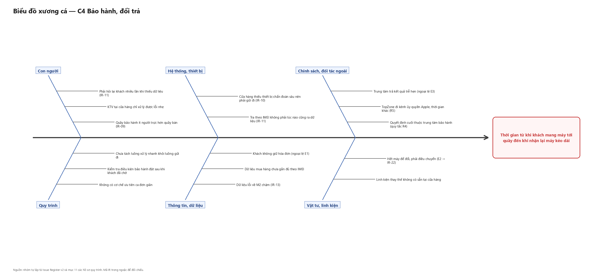

# Biểu đồ xương cá — C4 Bảo hành, đổi trả

**Người lập:** Nguyễn Thị Hồng Phúc · **Mục:** 4.5 Chương 4 · **Phiên bản:** v1
**Hình:** `fishbone-C4.png` — sinh bằng [`gen_fishbone.py`](gen_fishbone.py)

*Hình 4.x — Biểu đồ xương cá cho vấn đề thời gian xử lý một ca bảo hành kéo dài.*

> Caption hình đặt **dưới hình** theo quy ước ở P0-B. Số hình điền ở khâu soát danh mục.

---

## 1. Vấn đề đặt ở đầu cá

> **Thời gian từ khi khách mang máy tới quầy đến khi nhận lại máy kéo dài.**

Chọn vấn đề này vì ba lý do:

1. Hồ sơ C4 mục 11 chỉ định trực tiếp: năm điểm nghẽn B1–B5 là đầu vào cho biểu đồ xương
   cá ở mục 4.5.
2. Đây là vấn đề khách hàng **cảm nhận trực tiếp** — khác với các phát hiện ở lớp quản lý
   mà khách không nhìn thấy.
3. C4 là quy trình có nhiều phát hiện nhất trong ba quy trình cốt lõi được lập hồ sơ.

Vấn đề được phát biểu theo **hiện tượng quan sát được**, không phát biểu theo nguyên nhân.
Viết "quầy bảo hành thiếu người" là đặt sẵn kết luận vào đầu cá và làm hỏng cả biểu đồ.

## 2. Sáu nhánh nguyên nhân

| Nhánh | Nguyên nhân | Mã liên quan |
|---|---|---|
| **Con người** | Quầy bảo hành ít người trực hơn quầy bán | IR-09 |
| | KTV tại cửa hàng chỉ xử lý được lỗi nhẹ | — |
| | Phải hỏi lại khách nhiều lần khi thiếu dữ liệu | IR-11 |
| **Quy trình** | Chưa tách luồng xử lý nhanh khỏi luồng gửi đi | — |
| | Kiểm tra điều kiện bảo hành đặt sau khi khách đã chờ | — |
| | Không có cơ chế ưu tiên ca đơn giản | — |
| **Hệ thống, thiết bị** | Tra theo IMEI không phải lúc nào cũng ra dữ liệu | IR-11 |
| | Cửa hàng thiếu thiết bị chẩn đoán sâu nên phải gửi đi | IR-10 |
| **Thông tin, dữ liệu** | Khách không giữ hóa đơn | C4 ngoại lệ E1 |
| | Dữ liệu mua hàng chưa gắn đủ theo IMEI | — |
| | Dữ liệu lỗi về M2 chậm | IR-13 |
| **Chính sách, đối tác ngoài** | Quyết định cuối thuộc trung tâm bảo hành | C4 quy tắc R4 |
| | TopZone đi kênh ủy quyền Apple, thời gian phản hồi khác | C4 quy tắc R5 |
| | Trung tâm trả kết quả trễ hẹn | C4 ngoại lệ E3 |
| **Vật tư, linh kiện** | Hết máy để đổi, phải điều chuyển | C4 E2 → IR-22 |
| | Linh kiện thay thế không có sẵn tại cửa hàng | — |

Sáu nhánh chọn theo bộ 6M có điều chỉnh cho quy trình dịch vụ: nhánh "Vật liệu" đổi thành
"Vật tư, linh kiện", nhánh "Đo lường" đổi thành "Thông tin, dữ liệu" vì trong C4 thứ thiếu
là dữ liệu mua hàng chứ không phải phép đo, và thêm nhánh "Chính sách, đối tác ngoài" vì
actor bên ngoài quyết định phần lớn thời gian của quy trình này.

## 3. Ba nguyên nhân gốc rút ra

Không phải mọi nhánh đều nặng ngang nhau. Ba nguyên nhân dưới đây được xếp là gốc vì mỗi
cái kéo theo nhiều nhánh khác:

### 3.1 Cửa hàng không tự xử lý được lỗi phần cứng

Đây là nguyên nhân gốc nặng nhất. Nó nằm ở nhánh **Hệ thống, thiết bị** nhưng kéo theo:

- toàn bộ nhánh **Chính sách, đối tác ngoài** — vì phải gửi đi thì mới phụ thuộc trung tâm;
- nguyên nhân "KTV chỉ xử lý được lỗi nhẹ" ở nhánh **Con người**;
- và IR-10, phát hiện có khoảng chờ dài nhất toàn quy trình.

Hệ quả: chỉ số **tỷ lệ ca xử lý xong tại cửa hàng** (mục 9 hồ sơ C4) là con số quyết định.
Nếu tỷ lệ này cao thì phần lớn ca không chạm vào nhánh gửi đi và vấn đề ở đầu cá gần như
biến mất; nếu thấp thì mọi cải tiến khác chỉ gọt được vài phút trong một chu kỳ tính bằng
ngày. **Con số này đang ở trạng thái `(chờ khảo sát 23/08)` — câu phỏng vấn 1.**

### 3.2 Dữ liệu mua hàng không luôn tra được theo IMEI

Quy tắc R1 của hồ sơ C4 nói căn cứ bảo hành là IMEI gắn với đơn hàng trong hệ thống, không
phụ thuộc hóa đơn giấy. Nhưng ngoại lệ E1 lại mô tả tình huống không có dữ liệu và phải từ
chối. Hai điều này chỉ cùng đúng khi dữ liệu **chưa phủ hết** các đơn đã bán.

Đây là nguyên nhân gốc của IR-11, và nó nằm ở khâu trước: C1, C2, C3 phải ghi đủ IMEI vào
đơn thì C4 mới tra được. Cải tiến vì thế không nằm trong C4.

### 3.3 Chưa tách luồng nhanh khỏi luồng chậm

Mọi ca đều đi qua cùng một hàng chờ ở bước 1, dù ca đó là lỗi phần mềm xử lý trong mười
phút hay là ca phải gửi đi vài ngày. Bảng VA/BVA/NVA cho thấy nhánh xử lý tại chỗ (bước 7)
gần như không có NVA nào đáng kể — nhưng khách của nhánh đó vẫn phải chờ chung hàng với
mọi người.

Đây là nguyên nhân gốc thuộc nhánh **Quy trình**, và là nguyên nhân **cửa hàng tự can
thiệp được** — khác hẳn hai nguyên nhân trên.

## 4. Điều biểu đồ này chưa trả lời được

| Câu hỏi | Vì sao chưa trả lời được |
|---|---|
| Nhánh nào đóng góp nhiều nhất vào thời gian? | Chưa có số đo — mục 9 hồ sơ C4 đang `(chờ khảo sát)` |
| Tỷ lệ ca đi vào nhánh gửi đi là bao nhiêu? | Câu phỏng vấn 1, chờ buổi 23/08 |
| Khách chờ tới lượt trung bình bao lâu? | Cần bấm giờ tại quầy, chờ buổi 23/08 |

Biểu đồ xương cá là công cụ **liệt kê nguyên nhân có thể**, không phải công cụ chứng minh
nguyên nhân nào đúng. Ba nguyên nhân gốc ở mục 3 là **giả thuyết rút ra từ hồ sơ**, cần số
liệu khảo sát để xác nhận hoặc loại. Chương 4 phải trình bày đúng như vậy, **không viết
thành kết luận đã chứng minh**.
