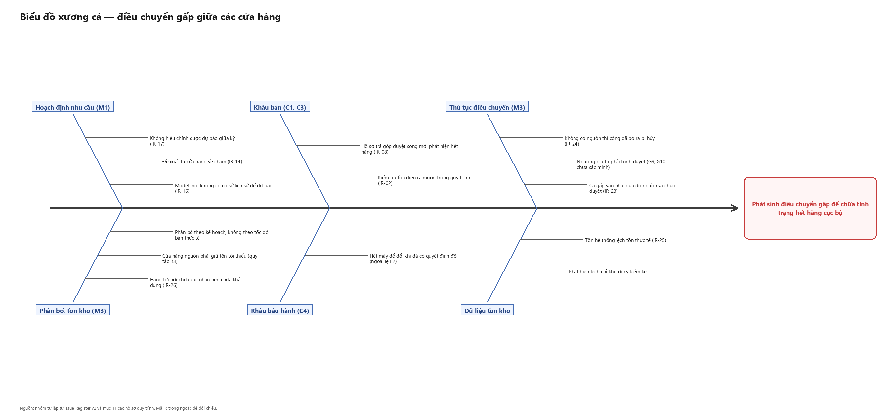

# Biểu đồ xương cá — điều chuyển gấp giữa các cửa hàng

**Người lập:** Nguyễn Thị Hồng Phúc · **Mục:** 4.5 Chương 4 · **Phiên bản:** v1
**Hình:** `fishbone-dieu-chuyen-gap.png` — sinh bằng [`gen_fishbone.py`](gen_fishbone.py)

*Hình 4.y — Biểu đồ xương cá cho vấn đề phát sinh điều chuyển gấp giữa các cửa hàng.*

---

## 1. Vì sao cần biểu đồ thứ hai

Biểu đồ thứ nhất soi một quy trình đơn lẻ (C4). Biểu đồ này soi một vấn đề **cắt ngang bốn
quy trình** — M1, M3, C3, C4 — và đó là lý do nó tồn tại: có những vấn đề mà nhìn từ bên
trong một quy trình sẽ không thấy nguyên nhân.

Cụ thể: khi khách C3 đã được duyệt hồ sơ trả góp rồi mới phát hiện hết hàng (gateway G8),
khách phải chờ điều chuyển. Từ góc nhìn của C3, đây là "hết hàng". Từ góc nhìn của M3, đây
là "yêu cầu điều chuyển gấp". Nhưng nguyên nhân thật có thể nằm tận M1 — dự báo sai từ đầu
kỳ. Không có biểu đồ này thì phần đề xuất ở mục 4.7 sẽ chỉ chữa ở M3, tức là chữa triệu
chứng.

## 2. Vấn đề đặt ở đầu cá

> **Phát sinh điều chuyển gấp để chữa tình trạng hết hàng cục bộ.**

Lưu ý cách phát biểu: vấn đề **không phải** "điều chuyển giữa cửa hàng". Điều chuyển theo
kế hoạch là hoạt động bình thường của M3. Vấn đề là phần điều chuyển **gấp**, phát sinh
ngoài kế hoạch để chữa cháy — đó mới là phần thuộc nhóm Move đáng phân tích.

## 3. Sáu nhánh nguyên nhân

| Nhánh | Nguyên nhân | Mã liên quan |
|---|---|---|
| **Hoạch định nhu cầu (M1)** | Model mới không có cơ sở lịch sử để dự báo | IR-16 |
| | Đề xuất từ cửa hàng về chậm | IR-14 |
| | Không hiệu chỉnh được dự báo giữa kỳ | IR-17 |
| **Phân bổ, tồn kho (M3)** | Phân bổ theo kế hoạch, không theo tốc độ bán thực tế | — |
| | Cửa hàng nguồn phải giữ tồn tối thiểu | M3 quy tắc R3 |
| | Hàng tới nơi chưa xác nhận nên chưa khả dụng | IR-26 |
| **Khâu bán (C1, C3)** | Kiểm tra tồn diễn ra muộn trong quy trình | IR-02 |
| | Hồ sơ trả góp duyệt xong mới phát hiện hết hàng | IR-08 |
| **Khâu bảo hành (C4)** | Hết máy để đổi khi đã có quyết định đổi | C4 ngoại lệ E2 |
| **Thủ tục điều chuyển (M3)** | Ca gấp vẫn phải qua dò nguồn và chuỗi duyệt | IR-23 |
| | Ngưỡng giá trị phải trình duyệt | M3 G9, G10 — chưa xác minh |
| | Không có nguồn thì công đã bỏ ra bị hủy | IR-24 |
| **Dữ liệu tồn kho** | Tồn hệ thống lệch tồn thực tế | IR-25 |
| | Phát hiện lệch chỉ khi tới kỳ kiểm kê | — |

Sáu nhánh ở đây **không dùng bộ 6M** mà chia theo **khâu trong chuỗi** — vì bản chất vấn
đề là chuỗi nhân quả đi qua nhiều quy trình, chia theo khâu làm lộ ra chuỗi đó rõ hơn.

## 4. Hai nguyên nhân gốc rút ra

### 4.1 Điểm kiểm tra tồn đặt quá muộn trong chuỗi

Ba nguyên nhân ở ba quy trình khác nhau cùng một dạng:

| Mã | Quy trình | Công bỏ ra trước khi phát hiện vấn đề |
|---|---|---|
| IR-02 | C1 | Công tư vấn chọn máy |
| IR-08 | C3 | Công tư vấn, lập hồ sơ, và cả chu kỳ chờ thẩm định tín dụng |
| IR-24 | M3 | Công dò nguồn sau khi đã hứa với khách |

IR-08 nặng nhất vì công bỏ ra trước khi phát hiện gồm cả khoảng chờ thẩm định — tức là đã
tiêu tốn thời gian của khách, của nhân viên, **và** của bên cấp tín dụng. Nếu đổi model
khác giá thì theo ngoại lệ E6 của hồ sơ C3, phải làm lại hồ sơ từ đầu.

Cách chữa cho cả ba là như nhau về nguyên tắc: **đưa điểm kiểm tra tồn lên sớm hơn**, hoặc
khóa tồn ngay khi bắt đầu chứ không đợi tới lúc xuất hàng. Đây là nhóm **Overdo** dạng
"công đã bỏ ra bị hủy" đã nêu ở bảng phân nhóm lãng phí.

### 4.2 Dự báo và phân bổ chạy theo kỳ, còn nhu cầu chạy theo ngày

Nhánh M1 và nhánh phân bổ M3 cùng chỉ về một chỗ: kế hoạch lập theo chu kỳ, phân bổ theo
kế hoạch, nhưng tốc độ bán thực tế ở từng cửa hàng lệch nhau và thay đổi trong kỳ. IR-17
nói rõ sai lệch phát hiện được nhưng không hiệu chỉnh được cho tới kỳ sau.

Kết quả là mọi lệch giữa kế hoạch và thực tế **buộc phải chữa bằng điều chuyển** — đúng
như hồ sơ M1 mục 11 điểm B3 đã ghi: một sai sót ở M1 không dừng ở M1 mà biến thành chi phí
vận chuyển ở M3.

Đây là nguyên nhân gốc mà **cửa hàng hoàn toàn không can thiệp được**. Đề xuất ở mục 4.7
liên quan nguyên nhân này phải nói rõ đối tượng thực hiện là khối văn phòng, không phải
cửa hàng.

## 5. Điều biểu đồ này chưa trả lời được

| Câu hỏi | Trạng thái |
|---|---|
| Điều chuyển gấp xảy ra bao nhiêu lần một tuần? | (chờ khảo sát 23/08 — câu Q2) |
| Từ lúc duyệt tới lúc hàng về mất bao lâu? | (chờ khảo sát 23/08 — câu Q3) |
| Tỷ lệ yêu cầu điều chuyển bị từ chối vì không có nguồn? | (chưa xác minh — dữ liệu nội bộ ERP) |
| Ngưỡng giá trị phải trình duyệt có thật không? | (chưa xác minh — M3 quy tắc R3, R4) |

**Cảnh báo về độ chắc chắn.** Biểu đồ này dựa nhiều vào hồ sơ M1 và M3, mà hai hồ sơ đó có
tỷ lệ nội dung `(ước lượng)` cao hơn hồ sơ C3 và C4 — M1 là quy trình khối văn phòng mà
nhóm không có kênh tiếp cận. Nhánh "Hoạch định nhu cầu (M1)" vì thế là nhánh **yếu nhất về
bằng chứng** trong cả hai biểu đồ xương cá. Chương 4 phải ghi rõ điều này thay vì trình bày
hai biểu đồ như thể có cùng mức tin cậy.
