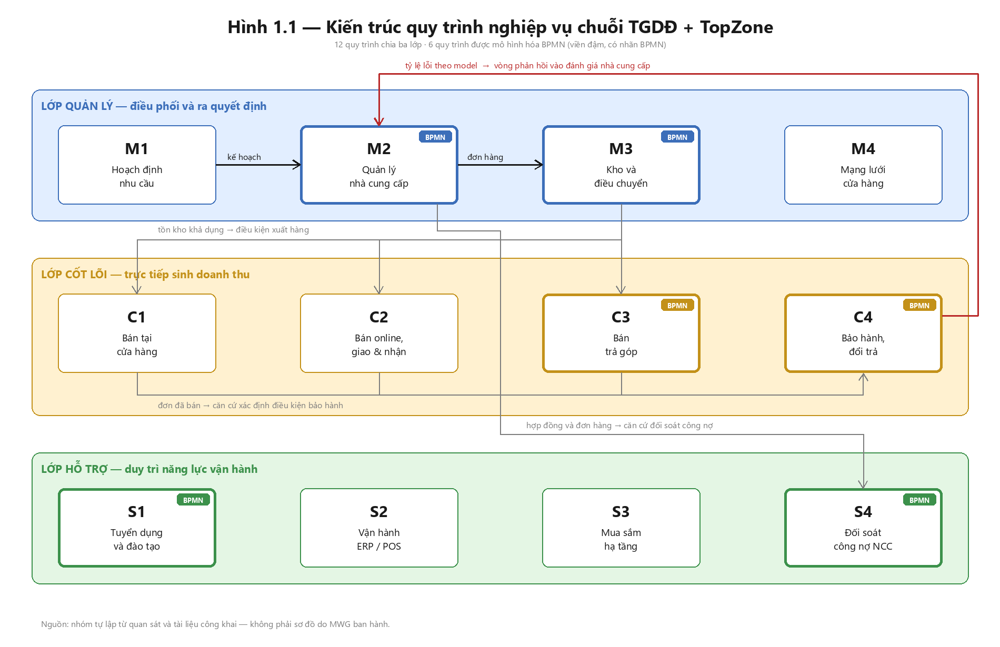

# Hình 1.1 — Kiến trúc quy trình nghiệp vụ

> **Hình 1.1** — Kiến trúc quy trình nghiệp vụ chuỗi TGDĐ + TopZone
> *(label hình đặt dưới hình theo chuẩn Phụ lục 2 khoa HTTT UIT)*

File nguồn: [gen_hinh_1_1.py](gen_hinh_1_1.py). Chạy lại bằng `python gen_hinh_1_1.py`
sau mỗi lần sửa nội dung, đừng sửa tay file PNG.

---

## Cách đọc hình

**Ba dải ngang** là ba lớp quy trình. Thứ tự từ trên xuống phản ánh quan hệ điều khiển:
lớp quản lý ra quyết định và cấp nguồn lực cho lớp cốt lõi, lớp hỗ trợ duy trì năng lực
để lớp cốt lõi chạy được.

**Sáu ô viền đậm có nhãn `BPMN`** là sáu quy trình được mô hình hóa: M2, M3, C3, C4, S1,
S4. Sáu ô còn lại chỉ lập hồ sơ dạng văn bản.

**Mũi tên** là sáu luồng trao đổi chính giữa các quy trình, đúng theo bảng "Quan hệ giữa
các quy trình" trong [phan-ra-12-quy-trinh.md](phan-ra-12-quy-trinh.md):

| # | Luồng | Nội dung trao đổi | Màu |
|---|---|---|---|
| 1 | M1 → M2 | Kế hoạch nhu cầu → yêu cầu đặt hàng nhà cung cấp | Đen |
| 2 | M2 → M3 | Đơn đặt hàng đã duyệt → lệnh nhập kho | Đen |
| 3 | M3 → C1, C2, C3 | Tồn kho khả dụng → điều kiện xuất hàng | Xám |
| 4 | C1, C2, C3 → C4 | Đơn đã bán → căn cứ xác định điều kiện bảo hành | Xám |
| 5 | **C4 → M2** | Tỷ lệ lỗi theo model → đầu vào đánh giá nhà cung cấp | **Đỏ** |
| 6 | M2 → S4 | Hợp đồng và đơn hàng → căn cứ đối soát công nợ | Xám |

## Vì sao vòng phản hồi C4 → M2 vẽ màu đỏ

Đây là luồng duy nhất đi **ngược** từ lớp cốt lõi lên lớp quản lý, và là luồng có giá trị
phân tích cao nhất trong hình:

- Dữ liệu lỗi thực tế phát sinh ở khâu bảo hành (C4) chỉ có ích cho việc chọn và đánh giá
  nhà cung cấp (M2) nếu quay về **kịp thời**.
- Độ trễ ở vòng này làm doanh nghiệp tiếp tục nhập model có tỷ lệ lỗi cao, chi phí bảo
  hành cộng dồn qua nhiều chu kỳ nhập hàng.
- Điểm nghẽn **B5** trong [hồ sơ C4](../ho-so-quy-trinh/cot-loi/C4-bao-hanh-doi-tra/ho-so-C4.md)
  ghi nhận đúng vấn đề này, và nó được chuyển sang Issue Register ở mục 4.6.

Vẽ nổi bật ở Hình 1.1 để Chương 4 quay lại tham chiếu mà không phải mô tả lại.

## Ghi chú về tính chính xác

Sơ đồ do nhóm tự lập từ quan sát và tài liệu công khai, **không phải sơ đồ tổ chức hay
kiến trúc quy trình do MWG ban hành**. Ranh giới giữa các quy trình là ranh giới phân
tích của nhóm, phục vụ mục tiêu môn học.

Nếu buổi khảo sát ngày 23/08 cho thấy ranh giới thực tế khác, sửa
[phan-ra-12-quy-trinh.md](phan-ra-12-quy-trinh.md) trước, chạy lại script, rồi ghi thay
đổi vào biên bản review chéo.
